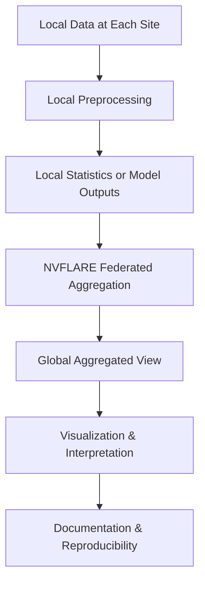

# Federated Visualization of Biomedical Datasets

## CMU × NVIDIA Federated Learning Hackathon (Jan 7–9, 2026)


### Team: Visualization Tool for Multiple Datasets

---

## 1. Problem Statement

In federated learning, biomedical data remains distributed across sites to preserve privacy.  
However, this makes it difficult to understand:

- What data exists across sites
- How datasets differ in structure and completeness
- Whether assumptions made for downstream modeling are valid

**Our goal** is to build a lightweight, reproducible workflow that enables **global visibility through visualization**, without sharing raw data.

---

## 2. High-Level Workflow




## How to use

1. First, install npm and docker

2. Then, run the ihcc-api server:

```
cd ihcc-api
# run elasticsearch
# Run Elasticsearch 7.x (compatible with Arranger)
docker run -d \
  --name elasticsearch \
  -p 9200:9200 \
  -p 9300:9300 \
  -e "discovery.type=single-node" \
  -e "xpack.security.enabled=false" \
  docker.elastic.co/elasticsearch/elasticsearch:7.17.10

# run the api server
npm run build
npm run prod
```

3. Then, open another terminal, run the ihcc-ui:
```
cd ihcc-ui
cp .schema.env .env
npm run buildAndServe
```

