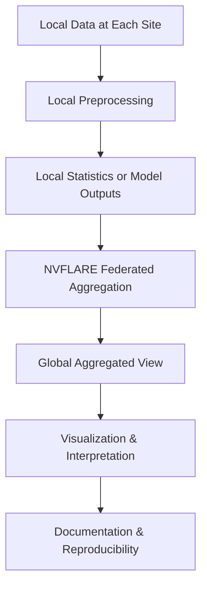

# Federated Visualization of Biomedical Datasets

## CMU × NVIDIA Federated Learning Hackathon (Jan 7–9, 2026)

https://github.com/IHCC-cohorts/ihcc-ui

### Team: Visualization Tool for Multiple Datasets

---

## 1. Problem Statement

In federated learning, biomedical data remains distributed across sites to preserve privacy.  
However, this makes it difficult to understand:

- What data exists across sites
- How datasets differ in structure and completeness
- Whether assumptions made for downstream modeling are valid

**Our goal** is to build a lightweight, reproducible workflow that enables **global visibility through visualization**, without sharing raw data.

---

## 2. High-Level Workflow

