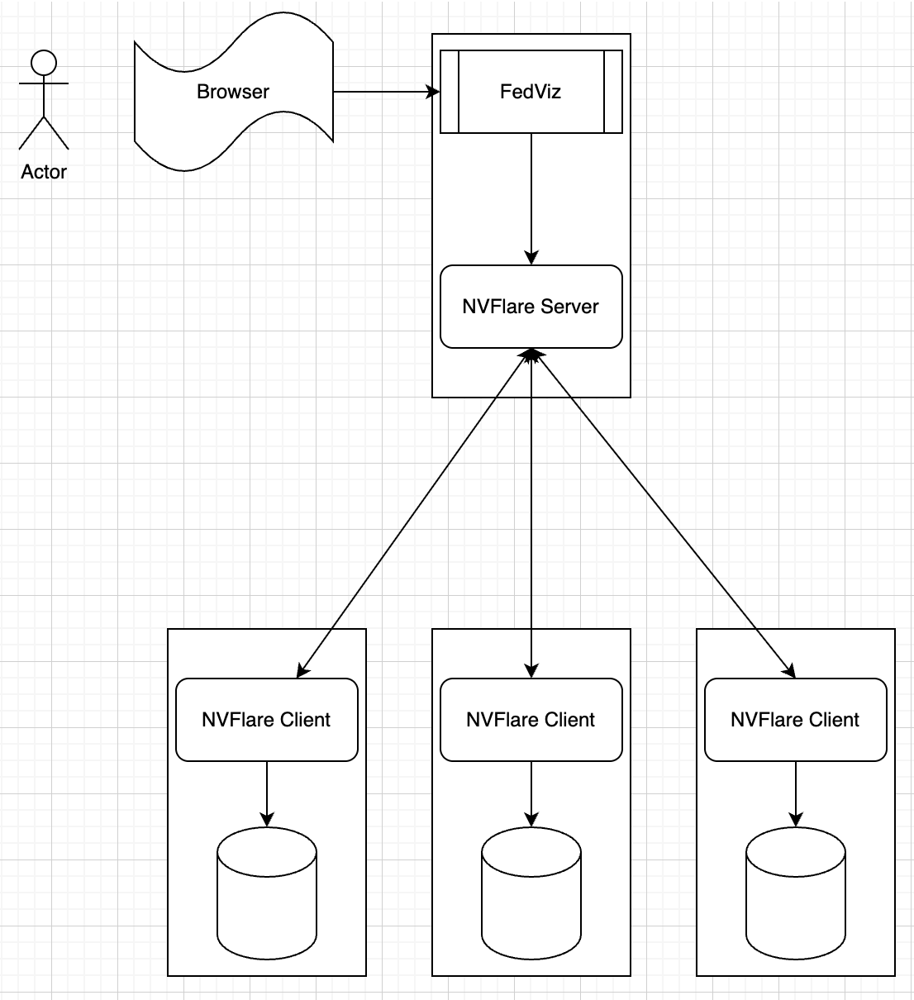
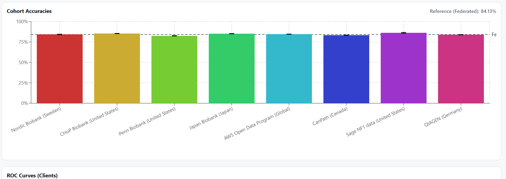
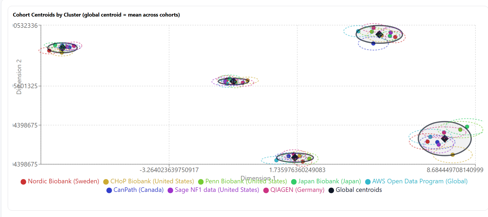
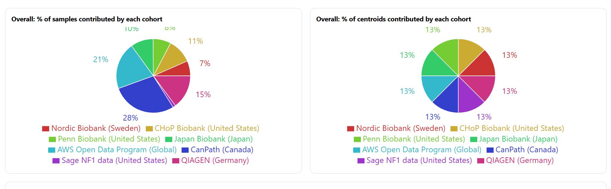
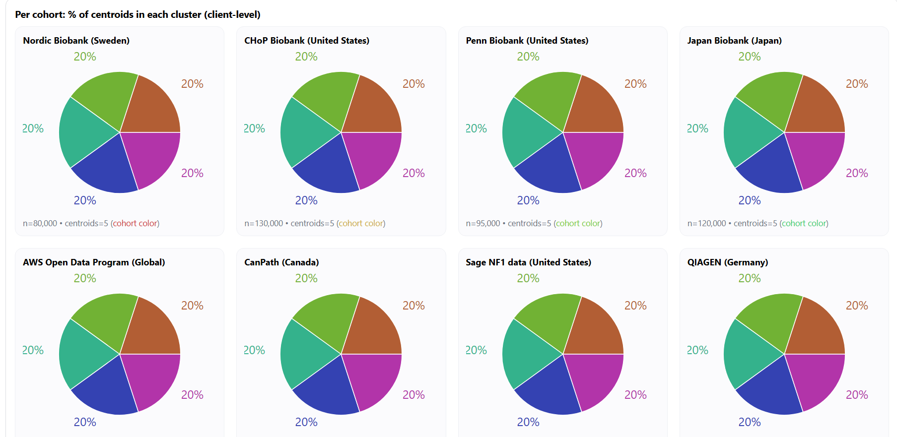

# FedViz: Federated Data Discovery & Visualization for Biobank Collaboration


## CMU × NVIDIA Federated Learning Hackathon (Jan 7–9, 2026)

**Team: Visualization Tool for Multiple Datasets**

---

## 🎯 The Challenge

**Different biobank sites have heterogeneous datasets, making federated learning nearly impossible without first understanding what data exists across the network.**

Before launching any federated learning project, researchers face critical questions:
- 🔍 What data does each site have?
- 📊 Are the features comparable across sites?
- 🏥 What's the sample size and quality at each location?
- 🤝 Which sites should collaborate on specific research questions?

**Without answers to these questions, FL projects fail before they start.**

---

## 💡 Our Solution: Federated Data Discovery Pipeline

We demonstrate an end-to-end workflow that enables **privacy-preserving data discovery and visualization** to prepare biobank networks for federated learning:

### 1️⃣ **Federated Cohort Discovery**
Each site runs a local data extractor that:
- Reads local patient data (remains on-site, never shared)
- Computes **aggregated cohort metadata** (cohort size, available data types, disease coverage, biospecimen types)
- Sends only the metadata summary to the central catalog

**Privacy preserved:** Raw patient data never leaves the site.

### 2️⃣ **Federated Statistics Computation**
Using **NVIDIA FLARE**, sites compute cross-site statistics:
- Mean age, standard deviation
- Disease prevalence (hypertension, diabetes)
- Genomic data availability
- Data quality metrics

**Privacy preserved:** Only aggregated statistics shared, not individual records.

### 3️⃣ **Interactive Dashboard Visualization**
Centralized dashboard displays:
- **Cohort Atlas**: Browse and search available cohorts with rich metadata
- **Harmonization Matrix**: Visualize which features are available across sites
- **Federated Statistics**: Compare aggregated metrics across the network
- **Readiness Assessment**: Identify which sites can collaborate on specific research questions

### 4️⃣ **Enable FL Collaboration**
Armed with discovery insights, researchers can:
- ✅ Select compatible sites for FL projects
- ✅ Identify harmonization gaps before training
- ✅ Plan data collection strategies
- ✅ Design robust cross-site studies

---

## 🏗️ Architecture



**Tech Stack:**
- **Federated Orchestration**: NVIDIA FLARE (NVFlare)
- **Backend**: Node.js + Python, Elasticsearch 7.17.x
- **Frontend**: React + TypeScript, Apache ECharts
- **Data Privacy**: Local computation, aggregated-only sharing

---

## 🚀 Demo Workflow

This demo simulates **8 real-world biobank sites** (Nordic Biobank, CHoP, Penn, Japan Biobank, AWS Open Data, CanPath, Sage NF1, QIAGEN) with heterogeneous patient data.

### Step 1: Setup Mock Sites
```bash
cd demo
python setup_sites.py
```
Generates mock CSV datasets for 8 sites at `/tmp/nvflare/cross_bio_bank/site-{1-8}/patients.csv`

### Step 2: Run Federated Workflows
```bash
bash run_both.sh
```

This executes two NVFlare workflows:

#### Workflow A: **Cohort Discovery** (`demo/discovery/`)
- Each site's `CohortMetadataExtractor` reads local `patients.csv`
- Computes cohort profile (name, size, countries, data types, diseases, biospecimens)
- Server's `CatalogWriter` aggregates all site metadata into:
  - `cohort_catalog.json` (rich metadata for dashboard)
  - `cohort_catalog.csv` (flat format for Elasticsearch import)

**Output:**
```
/tmp/nvflare/simulation/cohort_discovery/server/simulate_job/cohort_catalog.json
/tmp/nvflare/simulation/cohort_discovery/server/simulate_job/cohort_catalog.csv
```

#### Workflow B: **Federated Statistics** (`demo/fedstats/`)
- Each site's `PatientStatistics` computes local feature statistics (mean, stddev, histogram)
- NVFlare server aggregates across all sites
- Produces global statistics: mean age, disease prevalence, genomic data rates

**Output:**
```
/tmp/nvflare/simulation/patient_stats/server/simulate_job/statistics/patient_stats.json
```

### Step 3: Import to Dashboard
```bash
# Start Elasticsearch
cd ihcc-api
docker run -d \
  --name elasticsearch \
  -p 9200:9200 \
  -p 9300:9300 \
  -e "discovery.type=single-node" \
  -e "xpack.security.enabled=false" \
  docker.elastic.co/elasticsearch/elasticsearch:7.17.10

# Install dependencies and import data
pip install -r scripts/requirements.txt
python scripts/import_csv.py /tmp/nvflare/simulation/cohort_discovery/server/simulate_job/cohort_catalog.csv

# Start API server
npm run build
npm run prod
```

### Step 4: Launch Dashboard
```bash
cd ihcc-ui
cp .schema.env .env
npm run buildAndServe
```

### Step 5: Explore at http://localhost:3000/
- **Atlas Tab**: Browse discovered cohorts, filter by country, disease, data types

---

## 📊 Key Insights from Real Data Audit


Our audit of **14 international biobank nodes** revealed:

🔴 **Only 1.04% of variables are currently harmonized** (120 out of 11,511 unique variables)

This "Harmonization Gap" is why federated learning projects struggle:
- 98.96% of data cannot be used for cross-site training without additional mapping
- Different sites use different terminologies for the same clinical concepts
- No systematic way to discover what's compatible before launching FL

**FedViz addresses this by:**
✅ Making the gap visible through the harmonization matrix  
✅ Enabling targeted harmonization efforts where they matter most  
✅ Allowing researchers to select the 1.04% high-quality feature space for immediate FL pilots  
✅ Providing a roadmap for expanding harmonization to 5%+ through semantic mapping (future work)

**A Python-based layer ingests IHCC-style metadata CSVs (tracking 50,000+ participants per site) and transforms them into a standardized Federated Matrix.**
```
import rdflib
import os
import json
from collections import defaultdict

def find_repo_path():
    for root, dirs, files in os.walk('/content'):
        if 'data_dictionaries' in dirs:
            return os.path.join(root, 'data_dictionaries')
    return None

def get_federated_matrix(data_dir):
    variable_map = defaultdict(list)
    cohort_stats = {}

    print(f"📂 Processing files in: {data_dir}")
    
    files = [f for f in os.listdir(data_dir) if f.endswith(".owl")]
    if not files:
        print("⚠️ No .owl files found in the directory.")
        return None

    for file in files:
        cohort_id = file.replace(".owl", "").upper()
        path = os.path.join(data_dir, file)
        
        g = rdflib.Graph()
        try:
            g.parse(path, format="xml")
            labels = set()
            for s, p, o in g.triples((None, rdflib.RDFS.label, None)):
                var_name = str(o).strip()
                labels.add(var_name)
                variable_map[var_name].append(cohort_id)
            
            cohort_stats[cohort_id] = len(labels)
            print(f"✔️ Synced {cohort_id} ({len(labels)} variables)")
        except Exception as parse_error:
            print(f"❌ Failed to parse {file}: {parse_error}")

    threshold = len(cohort_stats) / 2
    common_vars = {k: v for k, v in variable_map.items() if len(v) >= threshold}

    output = {
        "summary": {
            "total_cohorts": len(cohort_stats),
            "total_unique_variables": len(variable_map),
            "common_variables_count": len(common_vars),
            "readiness_percentage": round((len(common_vars)/len(variable_map)*100), 2) if variable_map else 0
        },
        "matrix": variable_map,
        "cohort_sizes": cohort_stats
    }
    return output

repo_path = find_repo_path()

if repo_path:
    results = get_federated_matrix(repo_path)
    if results:
        with open("federated_matrix.json", "w") as f:
            json.dump(results, f, indent=4)
        print("\n🚀 SUCCESS! 'federated_matrix.json' is ready for the JS team.")
        print(f"📊 Summary: Found {results['summary']['common_variables_count']} shared variables across {results['summary']['total_cohorts']} sites.")
else:
    print("❌ ERROR: Could not find 'data_dictionaries' folder. Did you run 'git clone' in this session?")
```

---
# Cross-Site Biobanks Dashboard & Visualization

A visual analytics dashboard for cross-site biomedical cohorts with mock/demo data to support:
- Atlas view
- Data exploration
- Classification model evaluation (confusion matrix, cohort accuracies, ROC curves)
- Clustering visualization/performance (cohort vs global centroids, cluster ranges, cohort/cluster distributions)

## Key Features
A visual analytics dashboard for cross-site Biobanks with mock/demo data to support:

### Tabs
1. **Atlas**


2. **Classification Model Visualization / Performance**
   - Confusion-matrix quadrant pies (TP/FP/TN/FN)
   - Bar chart of cohort accuracy (derived from TP/FP/TN/FN)
   - ROC curves per cohort (synthetic/mock ROC points supported)



3. **Clustering Visualization / Performance**
   - Cohort-specific centroids per cluster
   - Global centroids as mean across cohorts
   - Cluster ranges (ellipses / dispersion visual)
   - Pie charts: cohort contribution by sample size (`n`) and centroid distributions



---
## 🚧 Future Directions

### Automated Semantic Harmonization
- **LLM-powered term mapping**: Automatically suggest synonyms for clinical variables
- **Expected impact**: Increase readiness index from 1.04% → 5%+
- **Example**: Map "HBP_AGE" (Site A) ↔ "hypertension_diagnosis_age" (Site B)

### Real-Time FL Model Performance Tracking
- Display per-site confusion matrices during federated training
- Track convergence metrics across heterogeneous data distributions
- Visualize fairness metrics (performance equity across demographics)

### Multi-Modal Data Support
- Extend beyond tabular data to imaging, genomics, EHR time-series
- Visualize data modality availability matrix
- Enable multi-modal FL project planning

---

## 📜 License & Citation

**MIT License** – Deploy freely at your biobank to audit FL readiness.

### References

**IHCC Consortium:**
```bibtex
@article{IHCC2020,
  title={The International HundredK+ Cohorts Consortium: Integrating Large-scale Cohorts for Global Health},
  author={Manolio, Teri A. and Goodhand, Peter and Lowrance, William and others},
  journal={Gene},
  volume={738},
  pages={144491},
  year={2020},
  publisher={Elsevier},
  doi={10.1016/j.gene.2020.144491}
}
```

**NVIDIA FLARE:**
```bibtex
@article{Roth2022,
  title={{NVIDIA FLARE}: Federated Learning from Simulation to Real-World},
  author={Roth, Holger R. and Cheng, Yan and Wen, Yuhong and Yang, Isaac and Xu, Ziyue and Hsieh, Yuan-Ting and others},
  journal={arXiv preprint arXiv:2210.13291},
  year={2022},
  url={https://arxiv.org/abs/2210.13291}
}
```

---

## 👥 Contributors

- **Hieu (Henry) Ngo**
- **Yuan-Ting Hsieh**
- **Aditya Kumar Karna**

---

**FedViz** — *Bridging the gap between raw biobank heterogeneity and robust federated model training.*
